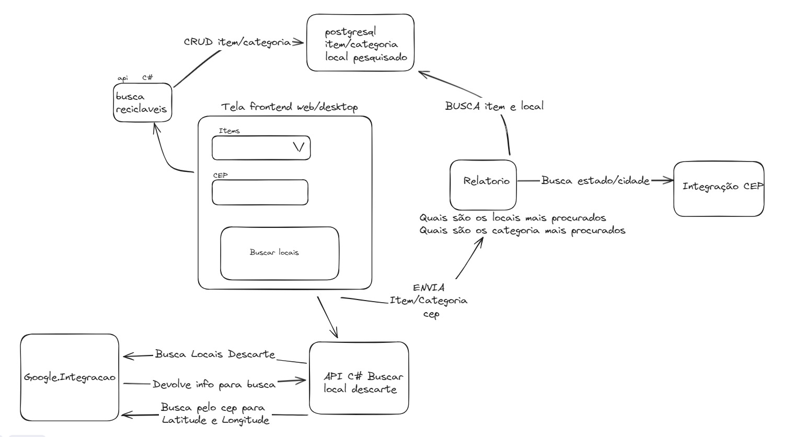

# APS_8-semestre

## Aplicação para saber o local onde descartar o lixo

### Features: 

-> busca de itens reciclaveis

-> local onde tem pontos de descarte de lixo que é referente ao selecionado do usuario

-> relatorios de items mais procurados & locais mais procurados

### Perguntas a serem respondidas:
- quais são os items mais procurados?
- quais são as cidades com mais pessoas pesquisando?
    
### JAVA com services pra relatorios com endpoints tipo
- relatorio-items-mais-procurados
- relatorio-locais-mais-procurados

### .NET com services pra integração com google
- busca de recicláveis
- busca de locais para descarte (integração com google_api)

## Arquitetura

## Backend
[Tecnologia Dotnet](./docs/CSharp.md)

[Tecnologia Java](./docs/Java.md)

## Frontend
